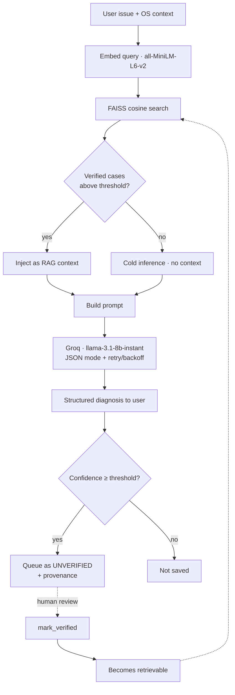

# 🖥️ IT Help Desk Agent

An IT support assistant that actually reasons from past tickets instead of guessing. You describe a problem, it digs up the most similar cases it has already solved, hands them to an LLM as context, and gives you back a clear, structured fix — category, confidence, the steps to take, the commands to run, whether to escalate, and how to avoid it next time.

The part I care most about: it can learn from its own answers, but it won't trust them until a human signs off. More on why that matters below.

## What it does

Most "AI helpdesk" demos are a single prompt wrapped around a chat box. This one is built around retrieval. When you ask something, it embeds your issue, searches a MongoDB-backed case base with FAISS, and pulls the closest **verified** matches to ground the model's answer. If nothing relevant turns up, it falls back to answering cold and tells you it did.

Everything comes back as structured JSON, so the UI can render it consistently and you're never left parsing a wall of text.

## The self-learning loop — and why it doesn't poison itself

This was the interesting design problem. If an agent writes its own answers back into the same knowledge base it learns from, you've built a feedback loop that can quietly drift on its own mistakes. So I split "should we save this?" from "should we trust this?"

When the model is confident, the answer does get saved — but as an **unverified** case, tagged with its confidence, the retrieval score that grounded it, and a `pending` review status. Crucially, retrieval ignores unverified cases by default, so the agent can never cite its own unreviewed output as if it were established fact. A case only becomes retrievable after a human calls `mark_verified()` and promotes it. Confidence, in other words, just decides what's worth a reviewer's time — it never grants trust on its own.

The result is a knowledge base that only grows through cases someone actually checked.

## How it works



MongoDB is the source of truth. The FAISS index is just a derived view of it, rebuilt in memory when the app starts.

## A few things under the hood

The Groq client is a little more careful than a bare `requests.post`. It asks for JSON mode so the model returns parseable output, retries with exponential backoff on rate limits and `5xx`s, and if a response still won't parse it gets one self-repair attempt before giving up. Case IDs come from an atomic MongoDB counter rather than a row count, so two requests landing at once can't collide on the same ID. And embeddings run on CPU by default — the model is tiny, the real latency is the network call to Groq, and this way nobody needs to fight with CUDA to get it running.

## Tech stack

Streamlit for the UI, Groq (`llama-3.1-8b-instant`) for generation, `sentence-transformers` (`all-MiniLM-L6-v2`) for embeddings, FAISS for vector search, MongoDB for the knowledge base, Pydantic for the response schema, and pytest for tests.

## Project layout

```
it-helpdesk-agent/
├── app.py                       # Streamlit UI + request handling
├── config.py                    # Models, thresholds, Mongo/embedding settings
├── migrate_to_mongo.py          # One-time JSON → MongoDB seed migration
├── agent/
│   ├── helpdesk_agent.py        # Orchestration: retrieve → prompt → call → persist
│   ├── llm.py                   # Groq client (JSON mode, retry/backoff)
│   ├── prompt.py                # Prompt builder (RAG context + JSON contract)
│   └── response_model.py        # Pydantic schema for the expected response
├── rag/
│   ├── retriever.py             # Verified-only retrieval, add/verify, store reload
│   ├── vector_store.py          # FAISS index (build/search/add)
│   ├── embedder.py              # CPU-first embedding wrapper
│   └── database.py              # MongoDB CRUD, indexes, atomic case_id counter
├── utils/
│   └── helpers.py               # Confidence labels/colors, escalation badge, JSON display
├── memory/
│   └── knowledge_base.json      # Seed cases (migrated into MongoDB)
├── conftest.py                  # Test fixtures (mocks sentence-transformers)
├── test_prompt_and_helpers.py   # Prompt + helper tests
└── requirements.txt
```

## Getting it running

You'll need Python 3.10+, a running MongoDB (it defaults to `mongodb://localhost:27017`), and a Groq API key from [console.groq.com](https://console.groq.com).

Set up the environment and install dependencies:

```bash
python -m venv it
source it/bin/activate          # Windows: it\Scripts\activate
pip install -r requirements.txt
```

Point it at your Groq key (and override Mongo or the embedding device if you need to):

```bash
export GROQ_API_KEY="your_groq_key"
export MONGO_URI="mongodb://localhost:27017"   # optional
export EMBEDDING_DEVICE="cpu"                  # "cuda" only if your torch build matches your GPU
```

Seed the knowledge base — this loads the cases from `memory/knowledge_base.json` into MongoDB as verified entries:

```bash
python migrate_to_mongo.py
```

Then launch it:

```bash
streamlit run app.py
```

Streamlit will print a URL (usually `http://localhost:8501`).

## Using it

Describe your issue in plain language, pick your OS and version, and hit **Diagnose Issue**. You'll get the diagnosis, the resolution steps and commands, an escalation flag, and some preventive advice — plus the similar cases that informed the answer, so you can see where it's coming from.

## Configuration

Most knobs live in `config.py`; connection details come from the environment.

| Setting | Where | Default | Purpose |
|---|---|---|---|
| `GROQ_API_KEY` | env | — | Groq authentication |
| `GROQ_MODEL` | `config.py` | `llama-3.1-8b-instant` | LLM model |
| `EMBEDDING_DEVICE` | env | `cpu` | `cpu` or `cuda` for embeddings |
| `TOP_K_RESULTS` | `config.py` | `3` | Max retrieved cases |
| `SIMILARITY_THRESHOLD` | `config.py` | `0.35` | Min cosine similarity to retrieve |
| `MIN_CONFIDENCE_TO_SAVE` | `config.py` | `0.75` | Min confidence to queue for review |
| `GROUNDING_THRESHOLD` | `config.py` | `0.50` | Similarity treated as "grounded" (provenance) |
| `MONGO_URI` / `MONGO_DB_NAME` / `MONGO_COLLECTION` | env | local defaults | MongoDB connection |

## Tests

```bash
pytest -v
```

The tests mock out `sentence-transformers` (see `conftest.py`), so they run fast and don't need the embedding model downloaded or a GPU present.

## Where it could go next

A few things I'm aware of and would tackle next:

The FAISS index lives in memory and is rebuilt from MongoDB at startup, which means embeddings get recomputed on every cold start and aren't shared across processes — persisting the vectors (or moving to MongoDB Atlas Vector Search) would fix that. The Pydantic `HelpdeskResponse` schema is defined but not yet enforced on the model's output, so validating against it is an easy win. There's no structured logging yet, which I'd want before trusting it anywhere real. The review queue works in code but isn't surfaced in the UI — `mark_verified` is callable but there's no approve screen yet. And there's no auth; this is a local/demo tool for now.

## Built with

Streamlit, Groq, FAISS, sentence-transformers, and MongoDB.
